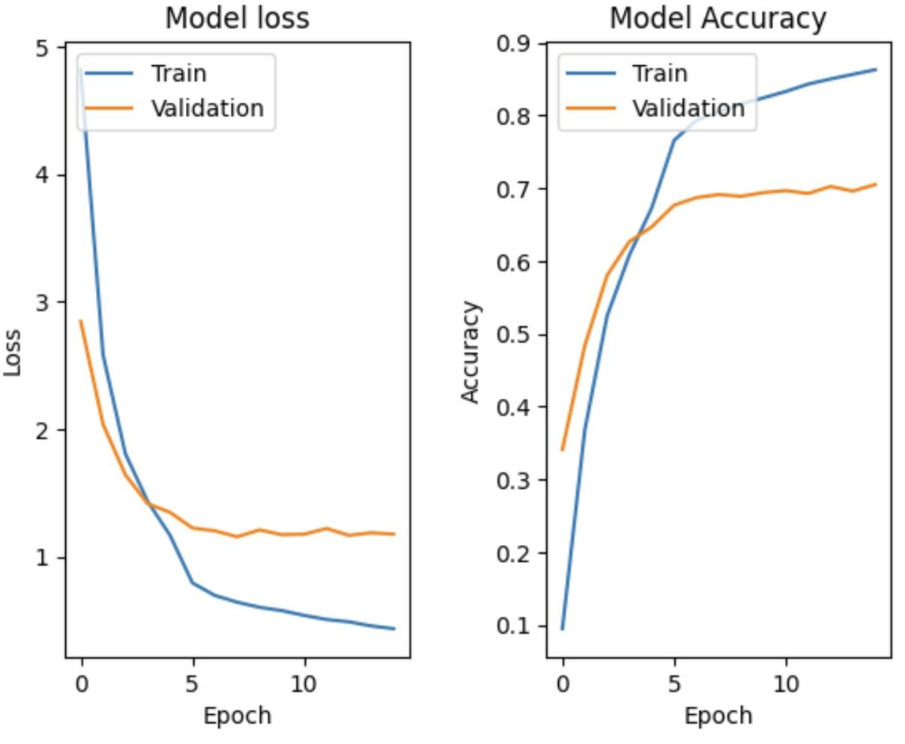
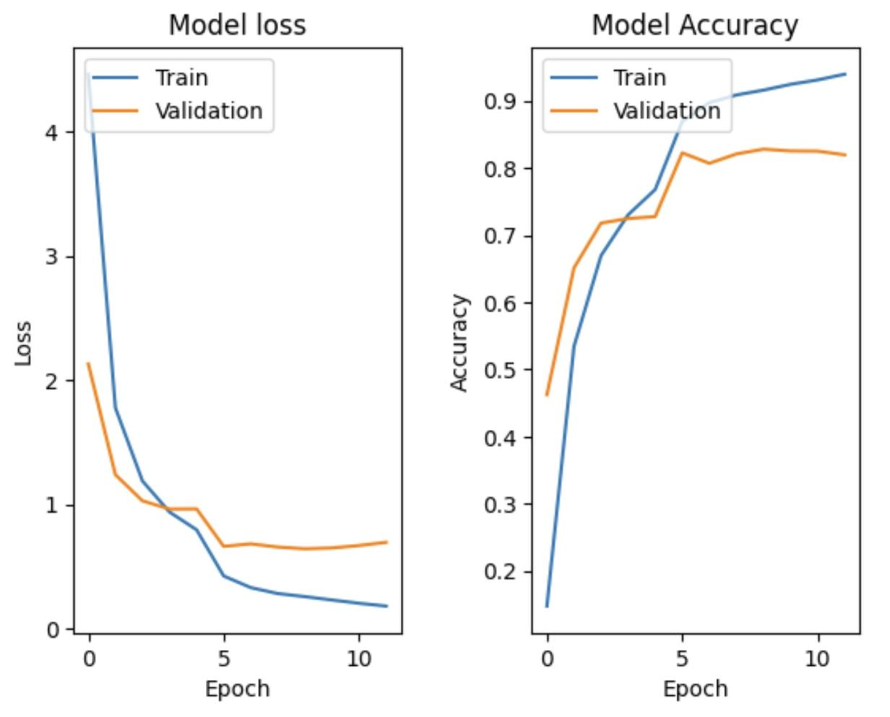

# cse455-sp23-finalproject
By Octi, Logan, Nathan, Jacob, and Ryan

Link to Figma Website design and information regarding project. 
NOTE: Please press play on top right hand side to be able to interact with our presentation. 

The main information for this project is located in our figma which includes a video link explaining each step.
https://www.figma.com/file/tepu7f74ey1i1eCa4duCzA/ReLu-Pioneers-team-library?type=design&node-id=0%3A1&t=knPuTCB7aRgjnYD0-1

Overview: 

In our kaggle competition, we were tasked with image classifications of different bird species from our CSE455 Computer Vision course. The task given was to recieve high accuracy score by classifying images and predicting correctly. 
We wanted to explore how different models dating from more ancient models to more modern models affected accuracy scores. Our approach was to start off with a semi-modern architecture like RESNET50, a simplier and older model such as VGG, and the most recent model

EfficientNetB4 to show see our results. We found the RESNET50 and VGG were not recieving higher than 50% accuracy due to major overfitting of the data. This caused an issue with our model overall because trying to train the model, it was memorizing more than trying to 
predict based off on pixels.

 In addition, we found memory issues that were starting to compile up as we gotten more modern models. Trying to balance tradeoffs of memory and accuracy was something we already tried to account for. 

Our next steps with trying to recieve higher accuracy score led to researching the most modern architecture being EfficientNet classification model. This model led to great results leading to a high 84% accuracy and outbeating other classifications in terms of accuracy.

This was beneficial to us because we allowered opportunities to improve from previous models and lead to better accuracy score. Though, the tradeoff is that we started to run out of memory as we began using more modern models. We wanted to try newer models than 
EfficientNetB4, but simply ran out of memory. 

For more information other than our overview, please refer to our figma link and watch our recording documenting and recording what we discovered. 

Here is our code: https://colab.research.google.com/drive/1dRH6rUHP2WDVyHtNwbFn7VhZ05O6gXqL

image.png #this is our VGG IMAGE MODEL

our EFFICIENTNETB0 images:

EfficientNet with input size 180

EfficientNet with input size 280

EfficientNet with input size 360

our model showing it is 84% accuracy result:

EfficientNetB4 with input size 480

Below is our code or running EfficientNetB7 and getting our desired results 
step1: Importing and Unzipping Data

step 2: Specifying and Finding Data to Train

step 3: processing the image 

step 4: freezing non-top layers 

step 5: Model summary 

image.png 
Step 6: Results of First Run

Step 7: Unfreezing more layers

step 8: Newest Model Testing

step 9: Mapping prediction to label

step 10: Export to kaggle

